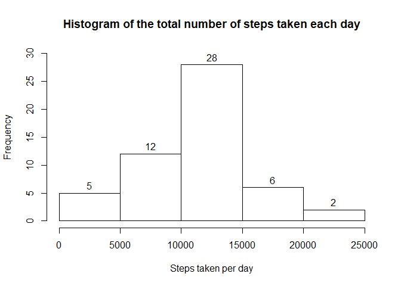
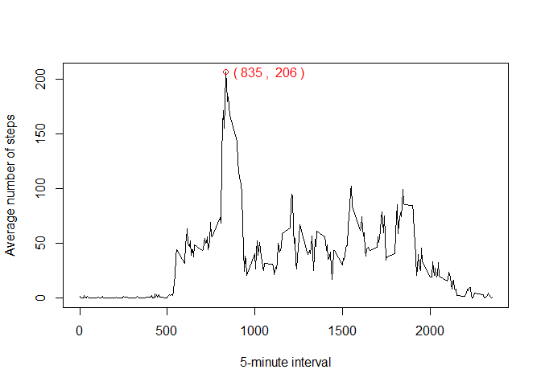
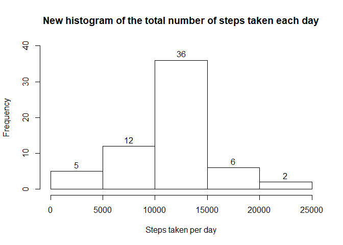

Set global option to print all code chuncks

```r
knitr::opts_chunk$set(echo=TRUE)
```

## Loading and preprocessing the data

```r
unzip("activity.zip")
data <- read.csv("activity.csv")
```

## What is mean total number of steps taken per day?
  Calculate the total number of steps per day ignoring the missing values

```r
stepsperday <- tapply(data$steps, data$date, sum) # If set na.rm = TRUE, the sum of the days with NAs would be equal to 0, which is not the case, once they are not 0, they were not informed. Without setting na.rm = TRUE, the sum of the days with NAs is equal to NA, which is ignored by the hist function.
```

Make a histogram of the total number of steps taken each day

```r
hist(stepsperday, xlab = "Steps taken per day", main = "Histogram of the total number of steps taken each day", labels = TRUE, ylim = c(0, 30))
```

<!-- -->

Calculate and report the mean and median total number of steps taken per day

```r
meanstep <- format(mean(stepsperday, na.rm = TRUE), digits = 5)
medianstep <- median(stepsperday, na.rm = TRUE)
```
The mean of total number of steps taken per day is **10766** and the median is **10765**  

## What is the average daily activity pattern?  

Make a time series plot (i.e. type = "l") of the 5-minute interval (x-axis) and the average number of steps taken, averaged across all days (y-axis)

```r
stepsperinterv <- tapply(data$steps, data$interval, mean, na.rm = TRUE)
plot(unique(data$interval), stepsperinterv, type = "l", xlab = "5-minute interval", ylab = "Average number of steps")
maxnsteps <- max(stepsperinterv)
maxnstepsinterv <- as.numeric(names(which.max(stepsperinterv)))
points(maxnstepsinterv,maxnsteps, col = "red")
text(maxnstepsinterv,maxnsteps, labels = paste("(", maxnstepsinterv, ", ", round(maxnsteps), ")"), pos = 4, col = "red")
```

<!-- -->
  
Which 5-minute interval, on average across all the days in the dataset, contains the maximum number of steps? **835**

## Imputing missing values  

Calculate and report the total number of missing values in the dataset (i.e. the total number of rows with NAs)

```r
sum(!complete.cases(data))
```

```
## [1] 2304
```
  
Create a new dataset that is equal to the original dataset but with the missing data filled in. The NA filling strategy was to take the mean of 5-minute interval.

```r
newdata <- data
for (i in 1:length(newdata$steps))
  if (is.na(newdata$steps[i]))
    newdata$steps[i] <- round(mean(data$steps[data$interval == data$interval[i]], na.rm = TRUE))
```

Make a histogram of the total number of steps taken each day and Calculate and report the mean and median total number of steps taken per day. Do these values differ from the estimates from the first part of the assignment? What is the impact of imputing missing data on the estimates of the total daily number of steps?

```r
newstepsperday <- tapply(newdata$steps, newdata$date, sum)
hist(newstepsperday, xlab = "Steps taken per day", main = "New histogram of the total number of steps taken each day", labels = TRUE, ylim = c(0, 40))
```

<!-- -->

```r
newmeanstep <- format(mean(newstepsperday, na.rm = TRUE), digits = 5)
newmedianstep <- format(median(newstepsperday, na.rm = TRUE), digits = 5)
```
After the NAs filling, the mean of total number of steps taken per day is **10766** and the median is **10762**. These values are very similar to those obtained in the first part of the assignment. The mean is the same and the median was slightly smaller. Moreover, the histogram was also very similar. Imputing missing data did not affect the mean and median of the total daily number of steps and just increased the frequency of steps between 10000 and 15000.

## Are there differences in activity patterns between weekdays and weekends?  
Create a new factor variable in the dataset with two levels -- "weekday" and "weekend" indicating whether a given date is a weekday or weekend day.

```r
Sys.setlocale("LC_ALL","English")
```


```r
newdata$date <- as.Date(as.character(newdata$date))
weekend <- c("Saturday", "Sunday")
newdata$weekday[weekdays(newdata$date) %in% weekend] <- "weekend"
newdata$weekday[!(weekdays(newdata$date) %in% weekend)] <- "weekday"
newdata$weekday <- as.factor(newdata$weekday)
```

Make a panel plot containing a time series plot of the 5-minute interval (x-axis) and the average number of steps taken, averaged across all weekday days or weekend days (y-axis)

```r
library("lattice")
library("dplyr")
```


```r
stepsbyintervweekd <- newdata %>% group_by(interval, weekday) %>% summarise(steps = mean(steps))
xyplot(stepsbyintervweekd$steps ~ stepsbyintervweekd$interval | stepsbyintervweekd$weekday, type = "l", xlab = "Interval", ylab = "Number of steps", layout = c(1, 2))
```

<!-- -->
  
There are differences in activity patterns between weekdays and weekends. During intervals between 500 and 1000, on weekdays the person used to give more steps, while between 1000 and 2000 on weekends he/she gave more steps. Maybe he/she, on weekdays, goes to a place (job/school) where he/she remain sit most part of the time and on weekends he/she does something more active.
